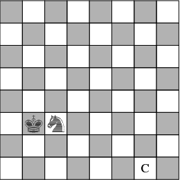

# 1.3 feladat

Adott egy sakktabla, melyre egy huszart es egy kiralyt helyezunk az abran lathato modon. A feladat az, hogy valamelyik figuraval a C jelu mezore  lepjunk. Csak azzal a figuraval lehet lepni a sakklepeseknek megfeleloen, amelyik eppen utesben van a masik altal.

## Megoldas

1. from=(5,2), to=(6,0)
2. from=(6,0), to=(7,2)
3. from=(5,1), to=(6,2)
4. from=(7,2), to=(5,1)
5. from=(5,1), to=(4,3)
6. from=(6,2), to=(5,3)
7. from=(4,3), to=(6,4)
8. from=(6,4), to=(7,6)

https://thenounproject.com/icon/chess-knight-589743/
https://thenounproject.com/icon/chess-king-6172954/